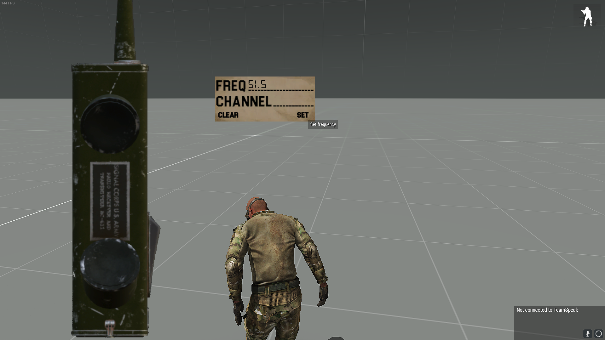
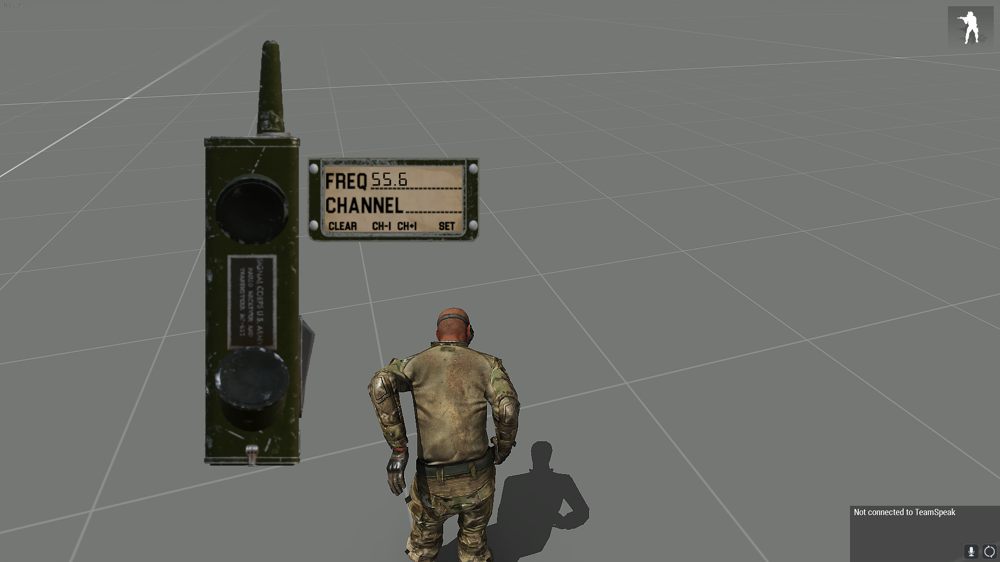
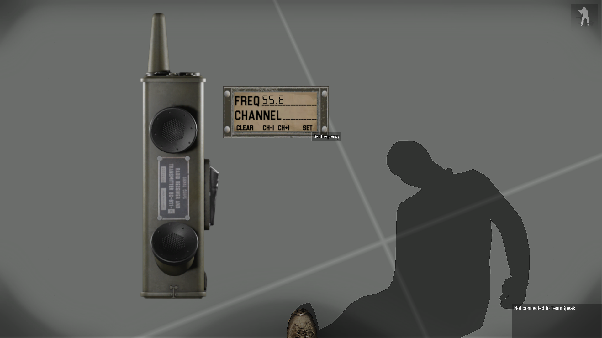
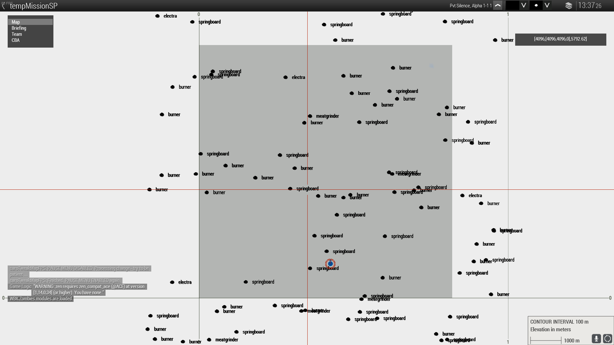
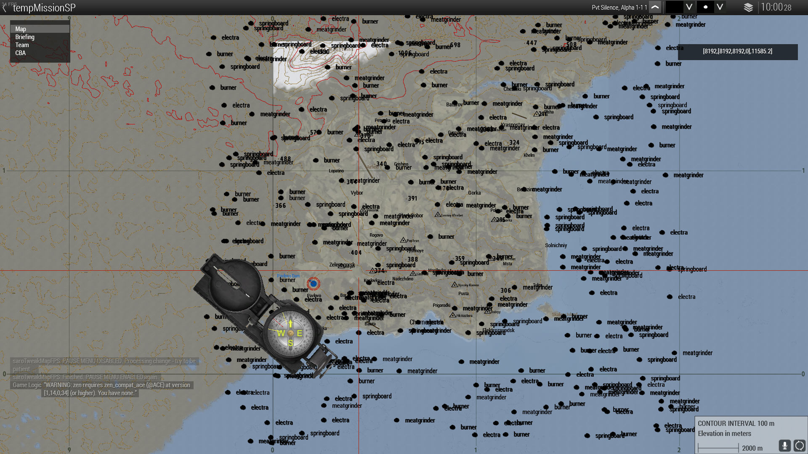
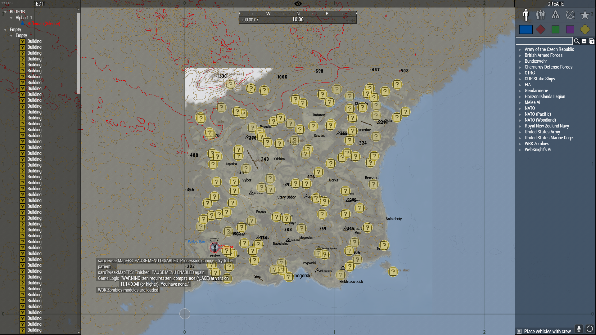
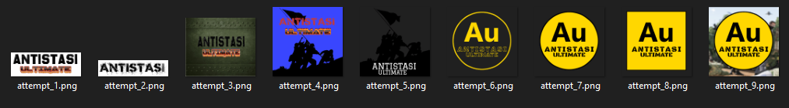
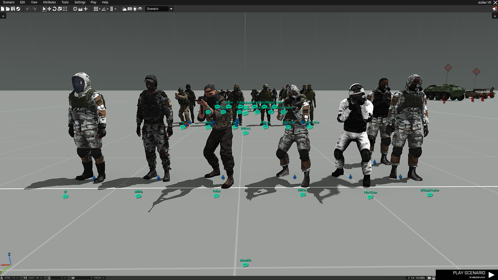
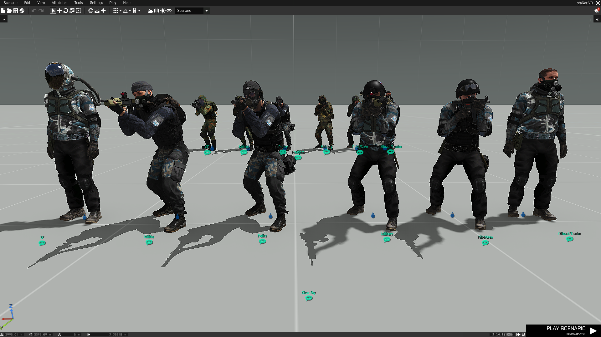
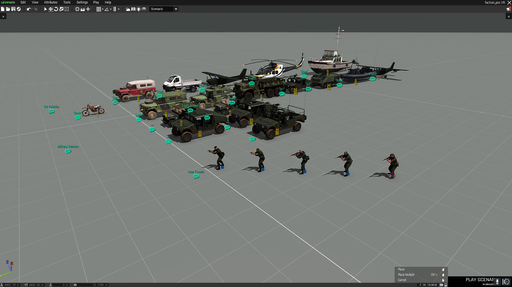

# Advice and Tips™ by Silence

- Do not take my advice too seriously.

  - You are your own person and you do your own things. These pieces of advice only serve as a general guide to stick to or as an expression of my thoughts.

  - My goal is that you *might* take something away from reading this and apply it in your own ways.

- Index

  - [General](https://github.com/Westalgie/A3UExtender/wiki/Developer-Advice#general-advice)
  - [Best Practices](https://github.com/Westalgie/A3UExtender/wiki/Developer-Advice#best-practices-advice)
  - [Coding](https://github.com/Westalgie/A3UExtender/wiki/Developer-Advice#coding-advice)
  - [Errors And Exceptions](https://github.com/Westalgie/A3UExtender/wiki/Developer-Advice#errorsexceptions)
  - [Data Types](https://github.com/Westalgie/A3UExtender/wiki/Developer-Advice#data-types)

## General Advice

  ### Do not think that something is impossible.

  - If you go into something expecting it to be impossible, it will be. You will give up easily and never accomplish what you want to.

  ### Do not ask to ask.

  - You should ideally look for an answer to your question before asking, but it's not strictly required. It just makes your life easier (you get a faster answer)

  - Just ask your question. If it is met with hostility then you are in the wrong place.

  ### Basically anything is possible.

  - You are limited only by your knowledge, will and creativity.

  - Simple mods such as this extender basically consist of putting pieces in the right places. Everything is a big puzzle but most importantly it is solvable through *trial and error*.

  ### Do not be afraid to "*Fuck Around and Find Out*".

  - Humans learn by making mistakes. We figure out how to fix them and avoid making the same mistakes in future.

  - You do not need to know literally everything before trying something. It creates a mountain that becomes impossible to scale because you forget where the bottom is. Everyone starts somewhere!

  ### Make things!

  - You will learn the most by just *doing*. You will learn things you need to know to achieve **whatever YOU want to achieve**.

  - Too many people think that the most efficient way to learn is to have words shoved into your face. This simply isn't the case. We actually retain information when we see the value in it, rather than because someone said it was valuable.

  - Make random projects regardless of if you think they'll be useful.
  
    - Me and another friend made a discord bot in Python that allows you to post random cat memes on discord. Does it do anything particularly useful? No. Was it fun to make? No doubt. It even taught me a few things that I didn't know before.

  ### Read and research.

  - It's an incredibly useful skill that is fading in the modern age. Ironic in the *information age* isn't it?

  - Reading or researching can solve a lot of problems. Not all problems though, you still have to touch grass every now and then.

  ### Tutorials for "coding" are useless in most cases.

  - They do not teach you how to "code", they teach you how to write things on a keyboard. 

  - "Coding" is mostly solving problems with your brain.

  - Tutorials are great for giving you an idea. Think driving a car. A "driving tutorial" will teach you how the road works, how a car works and more. It will not teach you how to drive. That can only be learned with experience!

## Best Practices Advice

  ### Prototype, Iterate, Refine.

  - You will always do things better the second and third time. Do not be afraid to re-do things if you aren't happy with the result.

  - Lets take the TFAR compatible SCR-536 Radio that me and Zelo designed for WW2 templates as an example.

  ---

  > First Attempt - Prototype. (Get the idea down.)
  

  ---

  > Second Attempt - Iteration. (Make it work.)
  

  ---

  > Third Attempt - Refinement. (Make it work, and look nice.)
  

  ---

  - Another example is when I was making STALKER Anomalies spawn across the entire map.

  ---

  > First Attempt - Prototype.
  

  ---

  > Second Attempt - Iteration. An extra 0 can cause... undesired outcomes.
  

  ---

  > Third Attempt - Refinement.
  

  ---

  - Yet another example that many people have not seen, so you have this luxury!

  ---

  > The first attempt.
  
  
  ---

  > The second attempt.
  

  - We did not settle on these logo designs because it was deemed they were too similar to Antistasi Community and Antistasi Plus.

  ---

  > Even more attempts before we finally settled on attempt_7 and attempt_9. The first 4 were designed by stutpip.
  

  ---

  ### Just because you can do something, does not mean you should.

  - If a piece of code (or anything) does not immediately explain the reason why it exists, document it.

    - Be thoughtful of any potential developers after you. If they're wondering "Why is this done in this way", you could have left a comment such as "X has weird behaviour if this is not here."

  ### Stick to naming and case schemes.

  - This will make your life easier. If you intend on anyone else seeing your work behind the scenes, they will thank you for having consistency.

  - Follow a case scheme. I'll list a select few as examples.

    - Pascal Case
    > MyFunctionName

    - Camel Case
    > myFunctionName

    - Snake Case
    > my_function_name

  - Arma 3 typically uses a mix of all 3.

    - Config Classes
    > CfgPatches

    - Function Names
    > myFunctionName

    - Compiled Function Names
    > TAG_fnc_myFunctionName

  ### Always save source files.

  - You may think it's fine to throw away source files once you have the finished result. This is stupid. You will need to change things, nothing is ever finished.

  ### Whitespace is free and infinite. Use it!

  - You have practically infinite space in your editor of choice. It's even free. There is literally no reason to be making your code hard to read.

  ### If you are making something and you want to use it as a template, make sure the base works first.

  - Hypothetical: You created a tropical faction template and now you want an arctic, arid and tropical version of it. If the original tropical version has any issues they will persist in your copied versions along with any new issues you introduced in the course of changing them.

## "Coding" Advice

  ### When creating anything with code involved, debugging and logging are essential.

  -  You will make mistakes, use those mistakes to learn. Logging is the key to finding out what you did wrong so do not ignore it.

  ### The ability to solve problems is underrated.

  - You will learn that coding requires a lot of problem solving. No tutorial or guide will teach you how to code. Only you can do that.

  ### Use whatever works for you.

  - Though I would recommend investing in proper tools and programs.

  - Use [Visual Studio Code](https://code.visualstudio.com/Download) instead of Notepad++. If you are writing in a language like C# or C++, use [Visual Studio](https://visualstudio.microsoft.com/downloads/) (Note: You should NOT use Visual Studio for Arma 3 C++. It is not the same as normal C++. Use VSCode instead.)

  ### Search engines are an amazing tool that people often do not utilize.

  - 90% of the issues i've had have been solved by Google or at the very least it has pointed me in the right direction.

## Errors/Exceptions

  ### Syntax Errors

  - Syntax errors occur because you messed up the syntax (duh).

  - These sorts of errors will usually say "Missing X", "Type X, Expected Y"

  - They're pretty simple. Read the error and you will probably be able to fix it.

  ---

  ### General Errors

  - A general tip for errors is: If an error "doesn't make any sense" or "is a complete lie", the computer is not necessarily wrong. You just don't understand how the computer interprets your code. 
  
  - An example:

  ```sqf
  my_animals = [
    "Cat",
    "Dog",
    "Pig",
    "Capybara",
    "Horse"
    "Cow",
    "Bird"
  ];

  diag_log my_animals;
  ```

  - This will cause an error.

  - The error is "Error Missing ], line 7". You may be thinking, "the ] is right there, what does it mean missing?"

  - The code stopped executing at line 6-7 ("Horse") because of a missing comma. Therefore there is an opening bracket but never a closing one (to the computer). Adding the missing comma will fix this.

  ```sqf 
  my_animals = [
    "Cat",
    "Dog",
    "Pig",
    "Capybara",
    "Horse",
    "Cow",
    "Bird"
  ];

  diag_log my_animals; // 19:00:15 ["Cat","Dog","Pig","Capybara","Horse","Cow","Bird"]
  ```

  - Be mindful of how you structure an array. Do not have a comma on the last element of an array.

  - Pay attention to what the error says! Read the error *properly* and make sure you *understand* it before jumping to conclusions. Too many times have developers not read the error properly thinking they knew what the problem was only to find out their ego was the problem.

  ---

  ### Cascade Errors (Also referred to as 'Cascade Failures')

  - These types of errors usually trip up new developers. Cascade errors are errors that are caused by other errors.

  - For example, function 1 takes in a string and creates a new variable using the old string, then appends "_test" to it. This is then passed to function 2 - This is fine. 
  
    - Now lets imagine that in function 1 you cause a syntax error and the new string variable doesn't get created as a result. Assuming the program does not stop executing, function 1 will error out as expected however function 2 will error out because it expected a string. 
    
    - In this case, function 2 only errored out because function 1 did not execute properly (This is not a great example, but you hopefully get the idea).
    
  - In general, always look for the top-most error and fix it. Rinse and repeat until no more errors occur.

  - For Antistasi, look for `A3A_fnc_compatibilityLoadFaction` in your rpt when there are issues with your template such as 'null' outposts. You will usually see "Loading template XYZ", and errors following it. Fix the first error, repack, try again, repeat.

## Data Types

  ---

  ### Boolean, bool

  - A boolean is just true (1) or false (0).

  > true

  > false

  ---

  ### Integer, int

  - An integer is a whole number that can be positive, negative, or zero. If a decimal is present (e.g 1.0), this is now a float.

  > 1
  
  ---

  ### Float, float

  - A float is basically an integer with a floating-point decimal.

  > 1.0

  ---

  ### String, str

  - A string is a sequence (hence string) of characters. To create one, wrap your characters in quotation marks.

  - A common character you can use in a string is "\n". It creates a new line!

  > "Hello, World!"

  > "Hello \n World!"

  ---

  ### Array, arr, "list" for some

  - An array is a collection of other data types. You can store multiple things in an array. Arrays vary from language to language, for SQF specifically they can hold multiple different data types in one array (int, bool, str, etc).

  - You can put an array inside of an array. This is commonly referred to as a "nested array" or a "multidimensional array". There is a difference, but you'll have to research that yourself.

  - To access an "element" of an array, you reference the index of the item. If I wanted to grab the first element you would reference the lowest index. Some languages use an index of 1 for the first element (Most use 0). SQF uses 0 for the first element.

  > [1, 2, 3, 4, 5]

  > ["Cat", "Dog", "Capybara"]

  > [1, 2, 3, 4, 5, ["Cat", "Dog", "Capybara"]]

  ---

  ### Dictionary, dict, "hashmap" for some

  - A dictionary is similar to an array in that it can store multiple different types. The key (ha) difference is that dictionaries work on a *key - value* principle. E.g "Name": "Silence".
  
  - To access a name I would only have to reference the "Name" key as opposed to looping through an array to find it. They are much faster to access, but are not always applicable.

  > {"Key": "Value"}
  
  ---

## Antistasi-Specific Advice

  ### Set realistic expectations.

  - You can dream until reality sets in and your dream becomes a nightmare.

  ### Do not use PBOManager or anything similar to pack addons. They are not meant for it. 

  - Use Addon Builder, HEMTT, Mikeros Tools, PboProject. Literally anything but PBOManager.

  - In the case of Antistasi and this extender example, use the install/build.ps1 files or the vscode method in the initial readme.md.

  ### Antistasi is mostly an open project. "Reverse engineering" is your friend.

  - Don't know how a faction template does something? Find the file for it and figure it out.

  ### Get a solid idea of what you want to do.

  - Making a faction? Plan it out in the editor. Make loadouts. Put down vehicles for each category. See my theoretical faction designs before they were made.

  ---

  > Monolith/Military Concept
  

  ---

  > Clear Sky/Freedom Concept
  

  ---

  > Western Loyalist Concept
  

  ### Be reasonable with mod usage.

  - If your faction requires more than 10 mods, people will instantly be turned away. If it can be done in less, do it in less!

  - A good example here is CUP and RHS. Both are good on their own but with both you have a ton of asset overlap, varying damage models and general problems. Not to mention the fact that the player now needs 50gb of storage.

  - Consider what mods the player may run with the mods you choose. If they choose to run ace, does your entire faction become unkillable?

  ### Be reasonable with asset usage.

  - Leave the player to gather some things themselves. Don't give them the best of the best straight off the bat, make them earn it.

  - If the player can get things instantly that they would normally have to earn, they have no incentives to seek it out.

  ### Avoid questionable or controversial faction or map choices.

  - Or don't. Do what you want!

  ### Test.

  - Test things you make. Do not let your ego get in the way and go "It's fine."

  ### Sign/key your mod.

  - This will allow people to run it on servers that use key signature verifications.

  - Use DSSignFile in Arma 3 Tools to generate a key (it will give you two):
    - `bikey` - this is the one you distribute with your addon.
    - `biprivatekey` - you use this one to sign. As the name implies, keep it private.
    - PBO files are signed with the `biprivatekey`.
    - The `bikey` should be copied into your `@Addon\keys` folder.